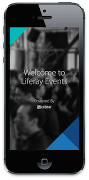
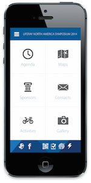
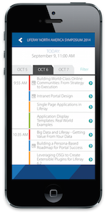

# Liferay Events

A cross-platform mobile app for in-person events such as symposiums, conferences, hackathons, etc.

This app is written in JavaScript on top of the [Titanium Appcelerator platform](http://www.appcelerator.com/). It uses [Liferay Portal](https://liferay.com)
as a backend data repository. It has successfully been used at Liferay's worldwide events since 2011
with thousands of speakers, sessions, attendees, and more.

To see this app in action at Liferay, check out the app on the [iTunes app store](https://itunes.apple.com/us/app/liferay-events/id650199231?ls=1&mt=8)
or [Google Play](https://play.google.com/store/apps/details?id=com.liferay.events.global.mobile&hl=en)!

  

# Kudos

This project began as a re-purposed version of an app developed and demoed at [WCS 2011](https://www.youtube.com/watch?v=PVRsCOxG3AY) by [LEVEL
Studios](http://www.level-studios.com/) (now [Rosetta](http://www.rosetta.com/)). The app was an early pioneering example of using Liferay to
serve rich content to a mobile platform. Rosetta graciously agreed to donate the base app to Liferay and since then we have been adding new features
in support of Liferay's worldwide events.

We wish to thank LEVEL Studios and Rosetta for their donation and commitment to the Liferay open source community!

## How to build and use this app for your own events

So you want to build and use this app yourself? No problem! But you'll need to build it yourself, so read all of these:

1. [Quick Overview and Features](docs/OVERVIEW.md)
2. [Dev Environment Setup and Build Instructions](docs/BUILDING.md)
3. [Setting up the Liferay Backend](docs/LIFERAY.md)
4. [Data Formats](docs/DATA.md)
5. [How to brand this app (aka white-labelling)](docs/BRANDING.md)

## How to Contribute

Just send pull requests! Also, ensure your code is bug-free, well-tested, architecturally sound, and practically perfect in *every* way.

## Future Ideas

* Use Alloy MVC
* Use layouts optimized for device (e.g. two-pane layout on tablets)
* Convert "fake" push notifications into real ones
* Use [Liferay Connector](https://github.com/smclab/liferay-connector)
* Smarter image handling on Android
* Login / attendee profiles
* Attendee linking via profiles
* Support for Apple Watch
* Batch uploading of photostream pics
* Convert to use [TiSocial.Framework](https://github.com/viezel/TiSocial.Framework) for Twitter and FB
* Interactive polling
* A cool activity stream

# Copyright and License

    Copyright (c) 2015, Liferay Inc. All rights reserved.

    Licensed under the Apache License, Version 2.0 (the "License");
    you may not use this file except in compliance with the License.
    You may obtain a copy of the License at

    http://www.apache.org/licenses/LICENSE-2.0

    Unless required by applicable law or agreed to in writing, software
    distributed under the License is distributed on an "AS IS" BASIS,
    WITHOUT WARRANTIES OR CONDITIONS OF ANY KIND, either express or implied.
    See the License for the specific language governing permissions and
    limitations under the License.

    All graphics are licensed under the Creative Commons Attribution-NoDerivatives 4.0 International License.
    To view a copy of this license, visit http://creativecommons.org/licenses/by-nd/4.0/.

# Notices

See the [NOTICES](NOTICE.md) file for details on open source libraries included in this project and how they are licensed!
